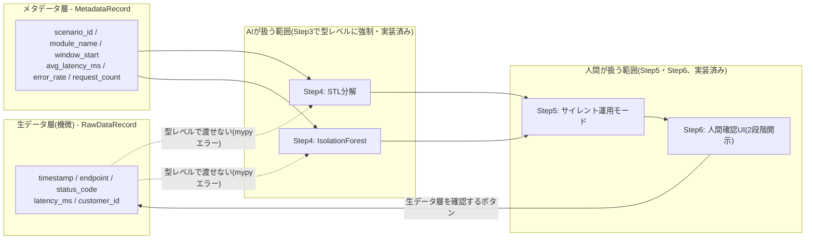
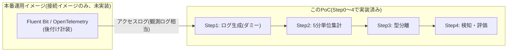

# log-anomaly-detection-poc

AIが機微データ（生ログ・実データ）に一切触れず、メタデータのみで異常の絞り込みを行う、
という設計思想を実装レベルで検証するPoC。

## アーキテクチャ(Step0〜6の実装範囲と、Step7の計画)

**AIが扱えるデータ範囲は、Step3で定義した2つのdataclassの型レベルで強制されている**
(`RawDataRecord`を検知関数に渡すとmypyエラーになる。詳細は
[メタデータ層と生データ層の型分離(Step3)](#メタデータ層と生データ層の型分離step3)節、
検証方法は`tests/test_type_separation.py`を参照)。Step5(サイレント運用モード)・
Step6(人間確認UI)も実装済みで、下図の「人間が扱う範囲」に含まれる。



誤検知率(precision/recall)の推移は、実際に学習データ量を変えて測定した実測値であり、
Mermaidの模式図ではなく[実測結果](#実測結果)の表と`evaluate_cli.py`の実行結果を参照。
上図でStep5・Step6を実装した根拠もこの実測結果にある:
固定閾値の検知器はrecallは出るがprecisionが8〜13%程度に留まり大半が誤検知という
結果が出たため、誤検知を運用に流す前にサイレントモードで精度を見極め(Step5)、
最終判断は人間の確認に委ねる(Step6)という2段構えを実装した。

本番運用を想定した場合、Step1のダミーログ生成部分は実際のログ収集層に置き換わる:



Fluent Bit/OpenTelemetry側は観測ログ(`timestamp`/`endpoint`/`status_code`/`latency_ms`)
相当の情報のみを流し、顧客IDなどの機微情報を含む生データ層は収集パイプラインの別経路
(生データストア)に留め、AI側の検知パイプラインには接続しない設計を想定している。

## セットアップ

```bash
uv sync
```

## 品質ゲートの実行

PRを出す前に、ローカルで以下を実行して緑になることを確認する。

```bash
./scripts/ci_check.sh
```

pytest（カバレッジ付き）・ruff・mypy（strict）・vulture（report only）・gitleaks・pip-audit を
まとめて実行する。GitHub Actions（`.github/workflows/ci.yml`）でも同じスクリプトを実行する。

ローカルで gitleaks を使うには別途インストールが必要（Ubuntu/Debianの場合 `sudo apt install gitleaks`）。

## pre-commitフック

```bash
uv run pre-commit install
```

コミット時に ruff・mypy・gitleaks（ステージ済みの差分）が自動実行される。

## ダミーログ生成(Step1)

```bash
uv run python -m log_anomaly_detection_poc --days 20 --output data/logs.csv --seed 42
```

- `--days` は任意の正の整数を指定できる(1週間=7・2週間=14・1ヶ月=30 に限定されない)
- `--seed` を固定すると常に同一データが生成される(デフォルト42)
- 出力は2ファイルに分離される
  - `--output` で指定したファイル: 観測ログ(`timestamp`/`endpoint`/`status_code`/`latency_ms`)。
    検知パイプラインに渡してよいのはこちらのみ
  - `<output>_ground_truth.csv`(`--ground-truth-output`で変更可): 正解ラベル
    (`label`/`anomaly_type`)。Step4の精度評価専用で、検知パイプラインには渡さない
- 異常イベント(`latency_spike`・`error_spike`)は「1週間ごとに1回ずつ」注入されるが、
  発生時刻・継続時間・対象エンドポイントは乱数で決まる。業務時間/夜間/週末でトラフィック量が
  最大6.7倍変動するため、該当行数は生成日数に対して単調に増えるとは限らない

## 前処理・5分単位集計(Step2)

```python
from log_anomaly_detection_poc.preprocessing import aggregate_observed_logs

aggregated = aggregate_observed_logs(
    dataset.observed, start=start, end=end, freq="5min"
)
```

- 観測ログを `endpoint × 5分バケット` に集計し、`window_start`・`endpoint`・
  `avg_latency_ms`・`error_rate`・`request_count` の列を持つDataFrameを返す
- 全エンドポイント × 全期間の5分バケットを0埋めで網羅する(トラフィックが存在しない
  バケットも行として残す)。STL分解が前提とする等間隔の時系列を壊さないため、また
  「トラフィックがない」ことを「データが欠損している」と区別するための設計
- `error_rate` は **5xxステータスのみ** を対象とする。4xxはクライアント起因
  (不正リクエスト・認証切れ等)で常に一定割合発生するノイズのため含めない。含めると
  Step1のerror_spike異常(5xx急増)のシグナルが基準ノイズに埋もれてしまう
- `request_count=0` のバケットは `error_rate=0.0`(エラーが発生しようがないため)、
  `avg_latency_ms=NaN`(リクエストがなくレイテンシ自体が未定義のため)
- 正解ラベル側は `aggregate_ground_truth` で同じグリッド・バケット境界に集計する
  (バケット内に`anomaly`が1件でもあれば`anomaly`、なければ`noise`があれば`noise`、
  それ以外は`normal`。トラフィックのないバケットは明示的に`normal`)

## メタデータ層と生データ層の型分離(Step3)

このPoCの核心部分。ログレコードを2つのdataclassに明確に分離し、**検知アルゴリズムが
メタデータ層のオブジェクトしか受け取れないことを型レベルで強制する**。

```python
from log_anomaly_detection_poc.data_layers import MetadataRecord, RawDataRecord
```

- `MetadataRecord`(5分バケット単位): `scenario_id`・`module_name`(=endpoint)・
  `window_start`・`avg_latency_ms`・`error_rate`・`request_count`。機微情報は
  一切含まない。検知アルゴリズムに渡してよいのはこの型のみ
- `RawDataRecord`(リクエスト単位): `scenario_id`・`timestamp`・`endpoint`・
  `status_code`・`latency_ms`・`customer_id`(顧客IDを模したダミー文字列)。人間が
  明示的に確認を選択した場合にのみ表示してよく、検知アルゴリズムには絶対に渡さない

検知関数(`detection.compute_stl_anomaly_score`・`compute_isolation_forest_anomaly_score`)
は `Sequence[MetadataRecord]` のみを受け付ける型シグネチャになっており、`RawDataRecord`
のリストを渡すとmypyがコンパイル時にエラーとして検出する(通常のdataclassによる
nominal typingにより、構造が似ていても別クラスとして区別される)。

**この型分離が壊れていないこと自体を検証するテスト** (`tests/test_type_separation.py`)
を用意している:

- `tests/type_fixtures/valid_call.py`: `MetadataRecord`を正しく渡す呼び出し
- `tests/type_fixtures/invalid_call.py`: `RawDataRecord`を渡す誤った呼び出し
- 上記2ファイルに対して `mypy` をsubprocessで実行し、前者はexit code 0、後者は
  exit code 1(かつ`RawDataRecord`という文字列を含むエラー)になることを検証する
- 型制約を意図的に緩めた場合にこのテストが実際に失敗することも確認済み
  (テスト自体が型分離の崩れを検知できることの裏付け)

## 異常検知と精度評価(Step4)

```bash
uv run python -m log_anomaly_detection_poc.evaluate_cli --show-progress
```

1週間/2週間/1ヶ月のデータそれぞれに対して、ログ生成→前処理→検知→評価のパイプラインを
実行し、precisionの推移を `data/precision_recall.png` にグラフ化する(`--output`で
変更可)。`--show-progress`でエンドポイントごとの計算進捗を表示できる。

- **STL分解**(`compute_stl_anomaly_score`): `module_name`ごとにSTL分解
  (statsmodels、周期=288=5分足の日次周期、`robust=True`)し、`avg_latency_ms`・
  `error_rate`それぞれの残差zスコアの大きい方を採用する
- **IsolationForest**(`compute_isolation_forest_anomaly_score`): `module_name`
  ごとに`[avg_latency_ms, error_rate]`の2特徴量でfit(`contamination="auto"`、
  正解ラベル不使用)。`request_count`は特徴量に含めない(深夜の正常な低トラフィック
  との誤検知を避けるため)
- 正解ラベルは`anomaly`のみを陽性として扱い、`noise`は陰性として扱う(ノイズを
  誤検知しないことがこのPoCの価値であるため)
- 閾値は固定値(STL: zスコア>3、IsolationForest: `fit_predict`の-1/1)。データ量
  ごとの最適閾値探索は行っていない

### 実測結果

低トラフィックバケット(request_count 1〜2件)は`avg_latency_ms`の分散が統計的に
安定せず誤検知の主因になるため、評価対象を`request_count>=5`(「統計的に安定する
最低限のサンプル数」という独立基準。precision最大化のための閾値探索ではない)に
絞ったフィルタ適用前後の両方を記録している。

各セルは **フィルタ前→フィルタ後**(`request_count>=5`)の値。

| 日数 | 所要時間 | STL precision | STL recall | IsolationForest precision | IsolationForest recall |
|---|---|---|---|---|---|
| 7日 | 25.8秒 | 0.043→0.133 | 0.900→1.000 | 0.007→0.080 | 0.900→1.000 |
| 14日 | 49.5秒 | 0.028→0.000 | 0.786→N/A | 0.004→0.000 | 0.786→N/A |
| 30日 | 125.3秒 | 0.042→0.103 | 0.745→0.857 | 0.009→0.060 | 0.941→1.000 |

- `N/A`はフィルタ後に実異常サンプル(TP+FN)が0件になり評価不能だったことを表す
  (0.000ではない。0.000は「正しく算出されたが的中0件」という真の値)。14日分は
  このseedでは注入された異常イベントが低トラフィック帯に偏って発生し、フィルタで
  全て除外された。異常の絶対件数が少ないPoC規模のデータでは精度指標の分散が
  大きいことを示す、意図的に隠さず残した結果
- フィルタによりprecisionは改善し、recallも維持または改善したが、フィルタ後も
  precisionは8〜13%程度に留まる(大半が誤検知)。これは固定閾値のナイーブな検知器は
  recallは出るがfalse positiveが多いことを示しており、Step5(サイレント運用
  モード)・Step6(人間確認フロー)が必要になる設計上の根拠になっている
- 30日分はSTL(`robust=True`の反復再重み付け)で約2分かかる。CIには含まれない
  手動実行スクリプトのみのコスト
- `MIN_REQUEST_COUNT_FOR_EVALUATION`は`evaluate_cli.py`(評価専用)にのみ存在し、
  `detection.py`の検知関数には組み込まれていない。実運用の検知パイプラインには
  影響しない、精度評価の母集団を絞るだけの措置

## サイレント運用モード(Step5)

```bash
uv run python -m log_anomaly_detection_poc.evaluate_cli --show-progress
```

Step4の精度評価パイプラインに統合されており、実行すると日数・アルゴリズムごとに
「本番トリアージフローへの移行可否」の判定結果も出力される。

- `silent_mode.accumulate_silent_mode_records`: 検知スコアを蓄積するだけの純粋関数。
  通知(print・アラート送信等)の副作用を一切持たないことで「検知結果を即座に
  通知しない」ことを関数の契約自体で保証する(Step3の型分離と同じ発想)
- `silent_mode.decide_production_readiness`: サイレントモード期間の`precision`
  (**フィルタ後**、`MIN_REQUEST_COUNT_FOR_EVALUATION>=5`適用後の値を使う)が
  閾値(デフォルト50%)以上なら`reason="ready"`、閾値未満なら
  `reason="insufficient_precision"`と判定する。`precision`がNaN
  (`TP+FP=0`、サイレントモード期間中に陽性判定を一件も出さなかった場合)は
  `reason="insufficient_samples"`と区別する。`TP+FN=0`(実異常サンプルが0件、
  recallがNaNになる条件)は`insufficient_samples`の判定には関与しない
  (recallの評価可否とprecisionの評価可否は別軸)
- 永続化(CSV/JSON出力、DB保存等)は一切行わない。Step6の人間確認UIが実際に
  必要とするデータ形式が固まってから検討するという、Step1(顧客IDダミーの
  合成タイミング)・Step3(型分離)以来の一貫した判断
- 閾値50%に対して、Step4の実測データ(7日/14日/30日いずれもSTL・
  IsolationForestともprecision 13%以下)では全て`reason="insufficient_precision"`
  (移行不可)と判定される。これはバグではなく実測結果通りの挙動であり、閾値を
  恣意的に下げるような調整は行っていない

## 人間確認UI(Step6)

```bash
uv run streamlit run src/log_anomaly_detection_poc/ui.py
```

Step5のサイレント運用モードが評価した検知結果を人間が確認するUI。Step3で確立した
型分離をUIのフローレベルでも維持し、生データ層は人間が明示的に選択した場合にのみ
表示する2段階開示にしている。

- `ui_logic.py`(pure/オーケストレーション関数、pytestで単体テスト)と
  `ui.py`(Streamlitレンダリングのみの薄い層、`streamlit run`で手動確認)に分離
- `ui_logic.run_detection_pipeline`は本番相当のパイプライン(`generate_logs` →
  `aggregate_observed_logs` → `to_metadata_records` → 検知スコア →
  `accumulate_silent_mode_records`)を実行する。Step4/5の評価パイプライン
  (`evaluate_cli.evaluate_at_scale`)とは異なり`ground_truth`を一切使わない
  (本番運用に正解ラベルは存在しないため)
- 第1段階: `flagged=True`のメタデータ層一覧を表示する(`scenario_id`・
  `module_name`・`window_start`・`algorithm`・`score`のみ)
- 第2段階: 各行の「生データ層を確認する」ボタンを押した場合のみ
  `data_layers.raw_data_records_for_window`を呼び出し、該当バケットのみを
  `RawDataRecord`に変換して表示する。既存の`to_raw_data_records`は観測ログ
  全体を無条件で変換するためUIからは使わない
- 学習データ量は`[7, 14, 30]`日の中から選択する(Step4で所要時間・精度を
  実測済みの値に限定。他の値は所要時間の実績がないため選択肢に含めない)。
  実行には数十秒〜数分かかるため、実行中は明確なローディング表示を出す
- 同じ`scenario_id`がSTL・IsolationForest両方でflaggedになることがあり、
  その場合は一覧に2行表示される。どちらか一方の「生データ層を確認する」を
  押すと、もう一方の行でも同じ生データ層(同一バケットのため内容は同じ)が
  表示される。データの誤りではないが、行ごとに独立した開示状態を持たせる
  設計にはしていない
